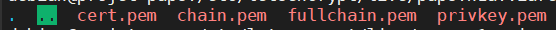

# The PAPS app ! :fried_egg: :green_salad:

Ce repo contient le code pour le site du paps qui permet de partager des recettes de d'organiser sa liste de course.

Plus d'informations ici: https://docs.google.com/document/d/1QQNS7YFifi6eaitlNc8k2h3rlRvja7o_O6aRMfCU7z0/edit#

Lisez ce fichier avant de contribuer, il contient des bonnes pratiques à suivre: [CONTRIBUTING.md](CONTRIBUTING.md)

## Structure générale du projet

L'application est construire avec NodeJS et Express. Le back-end communique avec le front-end avec Ajax par le end-point `/q`

Elle utilise une base de données RethinkDB que l'application lance et gère elle-même. Le dossier vers la base de donnée se trouve dans le fichier de config. Il est possible de lancer plusieurs instances du serveur sur plusieurs ordinateurs différents et avec un peu de configuration (ajout de l'ip d'un des serveurs dans l'option `--join host:port`dans `config.js`), ces instances vont synchronisées leurs données ce qui permet de supporter des millions d'utilisateurs si besoin.

Elle se lance en faisant `npm start` ou `node server.js`

## Installation

### Node

Si Node n'est pas installé, on commence par l'installer avec ces commandes (Pour Ubuntu ou Debian)

```sh
sudo apt-get install nodejs
sudo apt-get install npm
```

Sur Windows, Node est disponible ici: https://nodejs.org/en/

Pour savoir si Node est installé, entrez la commande `npm -v` dans un terminal. Si elle affiche une version, c'est que Node marche.

### PAPPS

On commence par télécharger le projet et installer les librairies requises par Node:

```
git clone https://github.com/vanyle/PAPPS/
cd PAPPS
npm install
```

Ensuite, il faut installer la base de données RethinkDB. Les instructions générales se trouvent ici: https://rethinkdb.com/docs/install/

### Pour Debian

```sh
export CODENAME=`lsb_release -cs`
echo "deb https://download.rethinkdb.com/repository/debian-$CODENAME $CODENAME main" | sudo tee /etc/apt/sources.list.d/rethinkdb.list
wget -qO- https://download.rethinkdb.com/repository/raw/pubkey.gpg | sudo apt-key add -
sudo apt-get update
sudo apt-get install rethinkdb
```

### Pour Ubuntu

```sh
source /etc/lsb-release && echo "deb https://download.rethinkdb.com/repository/ubuntu-$DISTRIB_CODENAME $DISTRIB_CODENAME main" | sudo tee /etc/apt/sources.list.d/rethinkdb.list
wget -qO- https://download.rethinkdb.com/repository/raw/pubkey.gpg | sudo apt-key add -
sudo apt-get update
sudo apt-get install rethinkdb
```

### Pour Windows

Téléchargez RethinkDB depuis cette URL: https://download.rethinkdb.com/repository/raw/windows/rethinkdb-2.3.6.zip

Décompressez le zip téléchargé et mettez l'exécutable `rethinkdb.exe` dans votre PATH ou dans le même dossier que `database.js` i.e. `/back`

## Mettre des trucs dans la base de donnée

Par défaut, la base de donnée est vide, donc, si vous lancez le site avec `node server.js`, et que vous allez à l'url du site, vous ne verrez aucune recette et vous ne pourrez pas vous connecter. Pour générer des données "de test", mettez dans `config.js` l'option `put_fake_data` à `true`. Cela à aussi pour effet de supprimer tout le contenu déjà présent, donc faites attention à n'utiliser cette option que dans un contexte de test.

Lorsque l'application est lancée, vous aurez accès à une console dans laquelle vous pourrez entrer des commandes. Pour tout supprimer de la base de données et pouvoir commencer à ajouter des utilisateurs, faites:

`erase_db_and_start_clean`

-------

Voilà les autres commandes disponibles:

`new_user <username> <password> [rights]`

Crée un nouvel utilisateur appelé `username` avec comme mot de passe `password`. Par défaut, cette utilisateur aura uniquement le droit `make_recipe`. Sinon, mettez la liste des droits que vous voulez, séparée par des virgules.

Exemple: `new_user tom azerty make_recipe,delete_recipe,delete_comment`

-------

`list_users`

Affiche la liste des utilisateurs du site, leur id, et si ils sont connectés.

-------

`logs <on/off>`

Active ou désactive les logs. Permet d'afficher ce que les utilisateurs font dans la console.

-------

Pour d'autres modifications plus poussées comme supprimer un utilisateur, il faut utiliser le site d'administration en supprimant de la config l'option `--no-http-admin`. Dans l'onglet `DataExplorer`, vous pouvez entrer des requêtes pour lire et modifier la base de données.

Exemple de requête: 

```js
r.table('users').delete({id:"<id_de_utilisateur_a_supprimer>"});
```

Plus d'information sur les requêtes possibles ici: https://rethinkdb.com/api/javascript/insert

## Mettre à jour le site

Faites la commande ci-dessous dans le dossier ou le serveur tourne pour mettre à jour le code du site. Lancer la commande après avoir arrêter le serveur.

```bash
git pull
```

## Déployer proprement le site

https://github.com/Unitech/pm2

```bash
npm install pm2 -g
pm2 start server.js
```

## Problèmes courants

### `Directory '../db/' is already in use, perhaps another instance of rethinkdb is using it.`

La base de données s'est arrêtée sans le site. C'est parfois le cas si le processus du site à été arrêté de manière trop violente. Par exemple avec un signal `KILL` ou lieu de `TERMINATE` ou `INTERRUPT`. (Il est recommandé d'utiliser le signal `INT` pour l'arrêt même si `TERMINATE` convient). Essayez de ne jamais utiliser `KILL` pour terminer le processus ! Cela pourrait endommager la base de donnée !

Il faut retrouver le processus de la base de donnée et l'arrêter manuellement.

```bash
ps aux | grep rethinkdb # Affiche la liste des processus utilisants la base de données
```

Plusieurs lignes font être affichés de cette forme:

```
root      1600  0.0  5.7 267136 117676 ?       Sl   00:01   0:25 rethinkdb -d ../db/ ........
root      1601  0.0  1.0  86372 21776 ?        S    00:01   0:00 rethinkdb -d ../db/ ........
```

Ensuite, pour chaque ligne contenant `rethinkdb`, faites

```bash
kill -2 <numéro du process à tuer>
# ici, par exemple, on ferait: kill -2 1600 et kill -2 1601
# si cette commande ne marche pas, remplaçez le -2 par un -15 ou un -9
```

### `Port 80 / 443 already in use`

Un autre processus utilise les ports dont notre application a besoin. Dans 90% des cas, c'est cette saloperie de `nginx`. Pour s'en débarrasser, il faut arrêter le processus `nginx`. Pour ça utiliser la commande kill avec un `-9` pour envoyer un signal `KILL`. Aussi, faites un `sudo apt-get remove nginx` et aussi supprimez tout les fichiers de config de nginx, le contenu de `var/www` et tout. Il faut tout détruire.

En général, utilisez la commande ci-dessous pour savoir quels applications utilisent des ports et quel est le processus associé à arrêter:

```bash
netstat -ltnp | grep -w ':80' # Remplacez 80 par le numéro du port qui pose problème 
```

### `ReqlOpFailedError: Cannot perform read: primary replica for shard ["", +inf) not available in:`

La base de donnée n'est pas encore prête mais vous avez essayer d'écrire ou de lire dedans. Cette erreur n'est pas grave, réessayer ce que vous aviez fait en attendant 1 seconde et ça devrait marcher. Si après 5 secondes d'attente, l'erreur est encore là, ce n'est pas normal (ce n'est jamais arrivé). Je conseillerais de relancer le serveur.

### Faire marcher le HTTPS

Par défaut, le site utilise HTTP. Si vous le lancez, vous verrez aussi une erreur comme quoi le HTTPS ne marche pas du type: "Unable to start HTTPS Server. Did you put the HTTPS secrets inside ./secret/ ?"

Pour faire marcher le HTTPS, il faut faire exactement ça, mettre les clefs HTTPS dans le dossier secret, qui devra alors ressembler à ça:



Vous pouvez alors lancer le serveur et le https marchera. Pour obtenir les clefs HTTPS, suivez le tutoriel de Viarezo avec Let's Encrypt et certbot. Celui-ci stocke les clefs dans `/etc/letsencrypt/live/` habituellement.

Alternativement, vous pouvez changer la valeur de `https_secret` dans la config pour mettre le chemin vers vos clefs (`/etc/letsencrypt/live/nom_du_site` en général si vous utilisez certbot)

## Structure du front-end

Le front-end se trouve dans le dossier `/client`. Tout fichier se trouvant dedans est fourni de manière statique au client et est accessible à l'adresse correspondant au nom du fichier (par exemple `client/style.css` est disponible à l'adresse `www.nom_du_site.com/style.css`)

Je recommande de séparer le front en plusieurs fichiers `.html` avec chaque fichier correspondant à un onglet du site. De plus, je recommande les bibliothèques suivantes:

- https://fontawesome.com/ pour les icones (version 5)
- https://fullcalendar.io/ pour le calendrier
- https://editorjs.io/ pour l'éditeur de recette (je sais pas si ça sera nécessaire mais si les gens veulent mettre des titres dans leurs recettes et du gras, ça peut être sympa)
- Eviter JQuery si possible sauf si vous estimez que c'est absolument nécessaire.

Bien sûr, vous pouvez utiliser les bibliothèques que vous voulez, ce sont des suggestions. Sinon, prenez bien les versions `minified` des bibliothèques quand vous les intégrez.

## Structure du back-end

Le back-end communique avec le front avec l'adresse `/q`. Les arguments sont fournis au front avec des paramètres GET. Le back-end utilise une base de donnée RethinkDB qui se base sur une structure JSON pour stocker les données. Plus d'info ici: https://rethinkdb.com/

Le schéma de données est décrit dans `./doc/fake_data.js` qui permet aussi de peupler la base de données avec des données fictives pour tester l'interface. (changer la configuration pour activer les données fictives.)

### Comptes et authentification

Le site supporte 2 types d'authentification:

**OAuth**: Utilise le compte Viarezo. Permet de voir les recettes, commenter et voter sur les recettes.

**login & password**: Utilise un mot de passe et un nom d'utilisateur. Il faut un accès ssh à la machine pour créer ce type de compte. Ce type de compte permet de commenter, voir les recettes, créer des recettes et modérer les commentaires.

### Listes des end-points (susceptible de changer.)

Note: Les endpoints en GET ne modifient pas la base de donnée et peuvent être appelés de manière répétée (sauf log et unlog). Ce n'est pas le cas des endpoints en POST qui eux modifient la base de donnée.

------

GET `/q?type=recipes&tag=tag1|tag2|tag3&s=query`

Renvoie la liste de toutes les recettes publiques du site au format JSON contenant les tags fournis et contenant dans leur description ou leur titre `query`. Si tag n'est pas pas renseigné, la requête renverra toutes les recettes disponibles par ordre de `rating` (jusqu'à un maximum de 100 recettes). Même chose si `s` n'est pas renseigné. Note: `s` est une expression régulière.

Format de la réponse:

```js
[{
	"id":"id",
	"title":"title",
	"description":"description",
     "image_id":"imageid
	"rating":4, // 0 - 5
	"tags":["tag1","tag2"],
},{...}, ...]
```

------


GET `/q?type=image&id=id`

Permet de récupérer une image d'après son identifiant. Renvoie l'image de manière brut.
Affichable avec ``

------

GET `/q?type=recipe&id=id`

Renvoie des informations détaillés sur une recette spécifique. Renvoie une erreur si la recette n'existe pas.

Format de la réponse:

```js
{
	"id":"id"
	"title":"title",
	"description":"description",
	"rating":4, // 0 - 5
	"image_id":"id" // might not exist or be null
	"tags":["tag1","tag2"],
	"steps":["step1","step2",...],
	"ingredients":["ingredient1","ingredient2",...],
    "creator_id":"id of creator",
	"creation_time":"2020-11-01T01:45:01.758Z" // something in this format, can be parsed with new Date(format)
	"comments":[
		{
			"name":"name of the commenter",
			"creation_time":"2020-11-01T23:51:15.760Z",
			"user_id":"id of the commenter",
			"content":"content of the comment"
		},
		...
	]
}
```

------

GET `/q?type=unlog`

Supprime les cookies de l'utilisateur et le déconnecte du site

------

GET `/q?type=log&name=<username>&pass=<password>`

Connecte l'utilisateur au site si name et pass sont correct. Modifie ses cookies pour que les requêtes suivantes se fassent en étant connecté. name et pass sont le nom d'utilisateur et le mot de passe sans encryption.

```js
{"co":"OK"} // authentification success
{"co":"NOOK"} // authentification failed
```

------

GET `/q?type=oauth`  (implémentation non terminée)

Redirige l'utilisateur de manière à la connecté par OAuth. Cette URL retourne un code 302. Il ne faut pas charger cette page par AJAX mais rediriger l'utilisateur vers elle pour que l'authentification puisse avoir lieu (avec `window.location` ou un lien par exemple). En cas de succès, les cookies de l'utilisateurs seront modifiés et les requêtes telles que `/q?type=uinfo` fonctionneront.

------

GET `/q?type=uinfo`

Retourne des informations relatives à l'utilisateur si celui-ci est connecté. Retourne une erreur si l'utilisateur n'est pas connecté.

Format de la réponse: `{"name":"name","rights":["admin","make_recipe"],"shopping_lists":[{...},...]}`

------

GET `/q?type=uname&id=<id>`

Retourne le nom de l'utilisateur dont l'id est `<id>` . Retourne une erreur si celui-ci n'existe pas.

Format de la réponse: `{"name":"name"}`

------

POST `/q?type=make_recipe`

Permet de créer une nouvelle recette. Le body de la requête POST doit utiliser le format JSON (`Content-Type:application/json`)

Le format du body est le suivant:

```js
{
	"title":"title", // max length = 100 characters All UTF8 is allowed (including emojis)
	"description":"description", // max length = 600 characters. All UTF8 is allowed (including emojis)
	"image":"", // filecontent of an image, as base64 encoding.
     "tags":["tag1","tag2"] // 6 tags max, max length of a tag = 50 characters. Must only contain lowercase letters (special characters like é,ż or ę are allowed) and spaces,
	"ingredients":["ingredient1","ingredient2",...], // must not be empty, max length = 100, max length of an ingredient: 200 characters. Only numbers, lowercase and uppercase letters and spaces are allowed and currency signs (€ or ¥)
	"steps":["Mix stuff","Heat it",...], // must not be empty, max length = 100, max length of a step: 1000 characters. Everything is allowed. Some custom formatting is supported (*bold*, ~strike~)
}
```

Tous les champs sont obligatoires sauf image. Les contraintes sont vérifiés côté serveur. En cas de non-respect des contraintes ,le serveur renverra une erreur et la recette ne sera pas créée. Je conseille que les tags puissent être choisis depuis un menu déroulant pour forcer l'utilisateur à classer son plat dans la catégorie "plat principal" ou "dessert", etc... pour faciliter la recherche. Si l'utilisateur n'est pas connecté ou ne possède pas le droit "new_recipe", la recette ne sera pas créée.

image doit être encodée avec une base64. Pour plus d'information, se référer au post suivant: https://stackoverflow.com/questions/34485420/how-do-you-put-an-image-file-in-a-json-object. La solution avec le canvas permet de crop l'image si celle-ci est trop grosse pour être gentil avec la back-end.

En cas de succès, la réponse sera: `{"id":"id"}` où `id` est l'identifiant de la recette créée.

------

POST `/q?type=delete_recipe&id=id`

Supprime la recette dont l'id est id si les droits de l'utilisateur effectuant la recette sont suffisant.

Retourne: `{msg:OK}` en cas de succès

------

POST `/q?type=make_comment&id=id`

Crée un commentaire sur le recette dont l'id est id. Le format du body est le suivant:

```js
{
	"content":"The content of the comment." // max length = 1000 characters
}
```

En cas de succès, la réponse sera `{"id":"id"}` où `id` est l'identifiant du commentaire créé

------

POST `/q?type=delete_comment&id=id&cid=id`

Supprime le commentaire avec l'id `cid` sur la recette `id` (si les droits de l'utilisateur effectuant la recette sont suffisant)

Retourne: `{msg:OK}` en cas de succès

------

POST `/q?type=rate&id=id&rate=rate`

Permet à un utilisateur de noter une recette. id est l'id de la recette à noter. rate est un nombre entre 0 et 5 inclus correspondant à la note donnée par l'utilisateur. Si l'utilisateur a déjà noté la recette, cette url modifiera la note précédente.

Retourne: `{msg:OK}` en cas de succès

------

Les url présentées sont définitives, les champs ne le sont pas: Un champ utilisateur et image seront probablement ajoutés pour les requêtes relatives aux recettes.

------

N'importe quel endpoint est susceptible de générer une erreur lorsqu'il est appelé. Dans ce cas, il retournera un objet de la forme `{error:"Description of the error"}`. La description de l'erreur ne dévoile aucune information confidentielle sur la structure de la backend. Des exemples d'erreurs sont: `database not ready. Please wait a bit.`  ou `type option not recognized`

-------

Liste des droits des utilisateurs

- Par défaut, un utilisateur non connecté peut voir toutes les recettes et les commentaires.
- Un utilisateur connecté peut commenter les recettes, les notés et supprimer les commentaire qu'il a créé et supprimer les recettes qu'il a crée.
- `make_recipe` donne le droit de créé des recettes
- `delete_recipe` donne le droit de supprimer n'importe quelle recette du site
- `delete_comment` donne le droit de supprimer n'importe quel commentaire du site

## Sécurité

Les mots de passe sont stockés hachés 30 fois avec du sel de qualité aléatoire cryptographique avec du sha256, selon un algorithme évitant le parcours de cycle large. Les requêtes sont effectués depuis du JS avec du NoSQL ce qui limite les possibilités d'injection. Le type de toute les variables provenant de l'utilisateur est vérifié pour voir si c'est bien "string". Le contenu stocké dans la base de donnée peut contenir des caractères du type `>` ou `<`. C'est au front-end de retirer ces caractères et d'appliquer des traitements de style. L'assainissement des données s'effectue côté client à la lecture, en particulier l'évasion des tags `HTML`.

Attention, lors du déploiement, le port permettant d'accéder à l'interface HTTP d'administration de la base de données ne doit pas être accessible. De même pour le port permettant de connecter d'autres serveurs pour la réalisation de clusters. Il faut donc bien indiquer les options `-no-http-admin` et mettre `db_port` et `db_port+1`à des ports inaccessibles depuis l'extérieur. (27017 et 27018 par défaut)